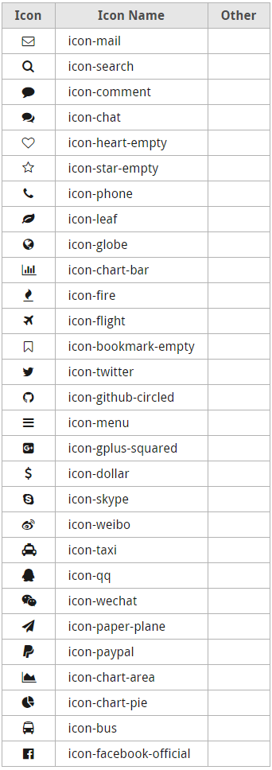

[](https://github.com/ellerbrock/open-source-badge/)
[](https://opensource.org/licenses/mit-license.php)  

## Configuration 

### PNG Logo

The image of `themes/forw/logo/logo.png` will be displayed as the logo of the website. You should overwrite it with your logo file. 

### Footer Page

You can add a file named `_footer.md` in the root of `content` folder. The content of this file will be displayed below the footer navigation bar. 

### Color Settings in One Place

You can change the color scheme of the site to yours, by changing the color values in `themes/forw/css/config.css`.

```css
--color-back:          hsl(0, 0%, 100%);

--color-base-brighter: hsl(219, 79%, 85%);
--color-base-bright:   hsl(219, 79%, 75%);
--color-base:          hsl(219, 79%, 65%);
--color-base-dark:     hsl(219, 79%, 55%);
--color-base-darker:   hsl(219, 79%, 45%);

--color-gray-brighter: hsl(0, 0%, 90%);
--color-gray-bright:   hsl(0, 0%, 70%);
--color-gray:          hsl(0, 0%, 50%);
--color-gray-dark:     hsl(0, 0%, 30%);
--color-gray-darker:   hsl(0, 0%, 10%);

--color-fore:          hsl(0, 0%, 0%);
```

## Template

### Index (Default)

This is the default template. If there is no template be specified, this template will be applied. Usually used for home page and content pages.

- With the `template: index` option to apply the template to this page.
- With the `navigate: header` option to show this page on header navigation bar.
- With the `navigate: footer` option to show this page on footer navigation bar.
- With the `order: nn` option to control the sorting in the navigation bar.
- With the `h1: XXX` option, you can add H1 heading to this page.
- With the `description: xxx` option, you can add a description to this page.
- With the `subnav: true` option, you can enable the sub-navigation function. The other page in the folder where the current page is located will be displayed in the sub-navigation bar.
- With the `main:` option, you can add banners and cards for this page. Details are below.

### AutoList

The page applied this template will become a list page showing all the files in the folder where the autolist page is located. Usually used for `index.md` in folder, so that the folder can list it's pages automatically. 

- With the `template: autolist` option to apply the template to this page.
- With the `navigate: header` option to show this page on header navigation bar.
- With the `navigate: footer` option to show this page on footer navigation bar.
- With the `order: nn` option to control the sorting in the navigation bar.

## More Details

### Header & Footer Navigation Bar

Use the `navigate` option in meta area to control which navigation bar the page's title is displayed on. 

| Option In Meta       |  Displayed On         |
|----------------------|-----------------------|
| navigate: header     | Header Navigation Bar |
| navigate: footer     | Footer Navigation Bar |
| _No navigate option_ | No Display            | 


### Banner

- Banner takes up one row.
- The background of the banner will follow the background color of the image automatically.
- Define a banner by the format of:

```yaml
main:
  - type: banner
    height: 100
    image: images/backgroud-peace.jpg
    text:
      title: Cloud Computing and Internet of Things
      slogan: Cloud computing in the cloud, internet of things in the fog.
      h_offset: 40   # based center, unit px.
      v_offset: -240   # based center, unit px.
      aligh: right   # left/center/right
      width: 300
      link_url: service/markdown-to-word
      link_text: See Details
      link_color: "bright" # bright/dark/normal
```

- Banner are also a good separator:

```yaml
  - type: banner
    height: 15
```

### Cards

- Cards takes up one row.
- Cards are containers for card.
- Card will average the width.
- Define a banner by the format of:

```yaml
  - type: cards
    height: 300
    cards:
      - title: Card1
        slogan: This is a card. The name of this card is Card1.
        image: images/icon-OpenWithCMD.png
        link_url: software/OpenWithCMD
        link_text: 'Go'
      - title: Card2
        slogan: The steps can't be too big, too big to pull the eggs.
        image: images/icon-PasteDirectory.png
        link_url: software/PasteDirectory
        link_text: 'Go'
      - title: Card3
        slogan: What's the most important thing of liar cooperation? Honest! 
        image: images/icon-WinGrid.png
        link_url: software/WinGrid
```

### Built-in Icons

You can use the build-in icons directly in the .md file by the format like `![i](image/icon name"></i>`.


